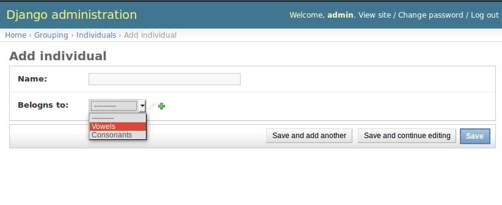
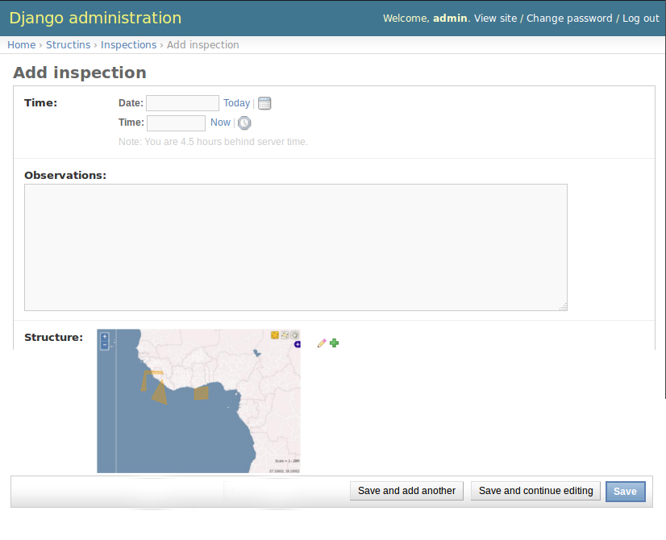

# django-geoFK-workshop
Workshop place to test ideas for future developement of django-geoFK (A geographic widget for a ForeignKey field referencing a  model with a geographic field).

# Motivation #

The Django admin page renders a *ForeignKey* as a `<select>` as it can be seen in [this django tutorial segment](https://docs.djangoproject.com/en/1.8/intro/tutorial02/#adding-related-objects).

This way, the relationship can be established from the admin add/edit page of the model with the *foreignKey*.

A classic example is a category relationship. Take models "Individual" and "Group":

```python
class Individual(models.Model):
  name = models.CharField(max_length=100)
  belogns_to = models.ForeignKey('Group')

class Group(models.Model):
  name = models.CharField(max_length=100)
```

Then, the admin page asociated to the "Individual" model, will offer a select list, prepopulated with *ALL* the Groups registered, in order to let the user select the group where the current indiviual belongs to.

This list is made of text. It is populated with an entry for each group, where each entry is rendered with the text representation of each group.



But if instead of the model "Group", the related model has a geographic field:

**It could be desirable to substitute the text list with a map, prepopulated with all the objects of the related model registered for the same reasons: let the user select the object to relate with the Individual.**

# Proposal #

As example, suppose the models "Inspection" and "Structure":

```python
class Inspection(models.Model):
  time = models.DateTimeField()
  observations = models.TextField()
  structure = models.ForeignKey("Structure")

class Structure(models.Model):
  name = models.CharField(max_length=100)
  feature = models.PolygonField()
  objects = models.GeoManager()
```

An inspection is done in a given time on a given structure. An structure could have many inspections.

The default add/edit admin page for inspections will render the structure field as a text list of structures (with a `<select>`).

What i would like to see is a map, presenting all the structures and let the user select one of them. Something like:



This idea is applicable to the admi list view. So the "Structure" list view could be a map with all the fetures rendered.

# Observations #

Django renders a geographic field by serializing a feature in WKT. Using this approach, a group of geografic objects could be rendered using:

 * Maybe a MULTI<feature> construct of WKT (MULTILINESTRING and MULTIPOLYGON).
 * Or a sintaxis for an array of features.

When the user "selects" a feature, somehow the "id" of the object stored in the database represented by it, should be fetched:

 * The population of features brings both the geometry and the id.
 * Or there is a request each time the user "selects" a feature, asking for the id of the feature at a given coordinate "A LA" [GetFeatureInfo](http://docs.geoserver.org/stable/en/user/services/wms/reference.html#getfeatureinfo).

# This Repository #

This repository will be used for exploratory reasons, trial/fail experiments to achieve the proposed modification to the admin page.

If this expirence light some hope on this feature, i will create a repository for it's developement (maybe named django-geoFK or django-geo-lists).

# Content #

This repository will contain sub django projects to explore the conecpts explained here.

I will use the beta version of django at the time (1.8). There is a `.python-version` which refers to a *virtualenv* version of Python: it works with [pyenv](https://github.com/yyuu/pyenv) and [pyenv-virtualenv](https://github.com/yyuu/pyenv-virtualenv).

For django beta i did:

    $ pyenv shell 2.7.8-django-1.8
    $ git clone git://github.com/django/django.git
	$ cd django
	$ git checkout -b 1.8b2 v1.8b2
	$ cd ..
	$ pip install -e django
